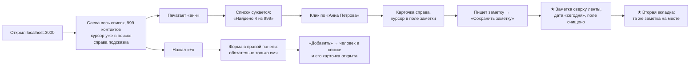
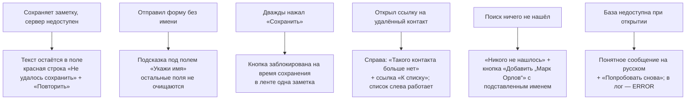
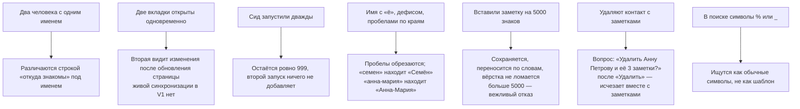
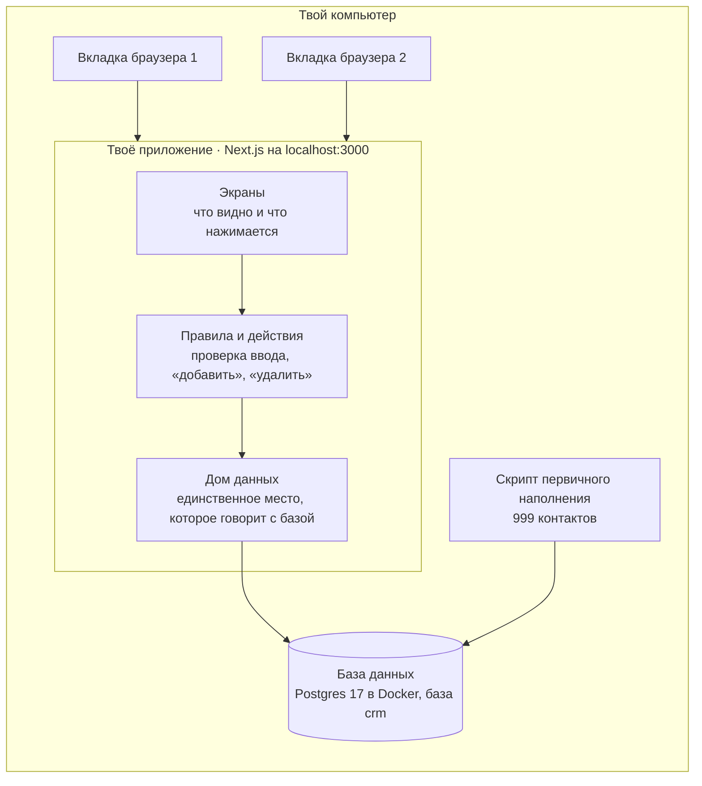

# Личная CRM — план сборки V1

> **Кому этот документ.** Это инструкция для ИИ-инструмента, который пишет код. Человек здесь — продакт-менеджер: он знает, что нужно пользователю, и принимает работу на чекпойнтах. ИИ — инженер: строит по этому плану, по одной фазе за раз, и **останавливается на каждом чекпойнте**.
>
> Наглядная версия для человека: `specs/03-prd.html`. Эскизы экрана: `specs/boards/`.

---

## 1. Проблема

Словами автора: «веду свои контакты — людей, которых знаю лично: кто это, откуда знакомы, телефон и почта, о чём договорились. Не для продаж, а чтобы **не терять людей и контекст общения с ними**».

Сегодня телефон и почта лежат в контактах телефона, а всё остальное — кто это, откуда знакомы, о чём договорились — размазано по мессенджерам, заметкам и памяти. Хуже всего — момент перед разговором с человеком, которого давно не слышал: не помнишь, о чём договаривались, и искать негде.

## 2. Видение

Один экран. Слева — список всех людей и поиск, в котором уже стоит курсор. Справа — карточка выбранного человека, и первое, что в ней есть, — поле для новой заметки. Поговорил с Анной → открыл вкладку → «анн» → клик → написал, о чём договорились → сохранил. Заметка встала сверху ленты с сегодняшней датой. Никаких переходов «туда и назад».

Это **не адресная книга**: заметка стоит выше телефона и почты, потому что сюда приходят за контекстом, а не за номером.

## 3. Цель (три строки)

1. **Что хочу получить:** не терять людей и контекст общения с ними.
2. **Как справляюсь сейчас:** телефон и почта — в контактах телефона; «кто это и о чём договорились» — в мессенджерах, заметках и в голове.
3. **Почему это плохо:** перед разговором не помню, о чём договаривались, а искать негде.

**Я пойму, что получилось, если** через 10–15 секунд после разговора человек найден и заметка записана.

Критерий успеха из спеки (проверяется в фазе 8 дословно):

- открыл → видно список всех контактов;
- добавил контакт → нашёл по имени → дописал заметку → изменения сохранились в карточке;
- открыл тот же адрес в другой вкладке/браузере → те же контакты.

## 4. Для кого

Один пользователь — автор. Обучающий пример. Приложение работает **локально на его компьютере** (`localhost:3000`). Ожидаемое число пользователей V1: 1. Первичное наполнение — 999 выдуманных контактов.

**Сознательно отложено на «после первой сборки»** (не строить и не готовить заранее): вход и регистрация (**сделано 18.09.2026:** вход по ссылке из письма, `specs/05-вход-и-пользователи.md`), «нормальная» БД вместо SQLite (**сделано 18.09.2026:** Postgres 17 в Docker), многопользовательский режим (**сделано 18.09.2026:** у каждого свои контакты), выкладка в интернет, уведомления, офлайн.

Проверка идеи: автор пришёл с уже проверенной идеей; внешнего исследования в этой сессии не было. Потребности помечены честно:

| Потребность                                                                 | Метка                                                           | Чем подтверждена                               |
| -------------------------------------------------------------------------------------- | -------------------------------------------------------------------- | ------------------------------------------------------------- |
| Быстро записать, о чём договорились, пока помню | догадка автора (его собственная боль) | личный опыт, подтверждён в сессии |
| Найти человека по имени за секунды                        | догадка автора                                          | личный опыт                                         |
| Видеть всю историю общения в одном месте             | догадка автора                                          | личный опыт                                         |

Для личного инструмента этого достаточно. Это **не** рыночная проверка — вернуться к ней, если появятся другие пользователи.

## 5. Пользовательские потоки

Состояние экрана живёт в адресе страницы: `/?q=анн&contact=412`, `/?new=1`, `/?contact=412&edit=1`. Обновил страницу — всё на месте.

### 5.1. Хороший день



### 5.2. Плохой день



### 5.3. Странные, но настоящие случаи



## 6. Функции

### V1 — собрать сейчас

Вышло из карты истории (`specs/boards/storymap.png`): на каждом шаге пути — «что должно быть правдой, чтобы человек этот шаг прошёл».

**Открыть**

- Список всех контактов по алфавиту; над списком счётчик («999 контактов», с правильным склонением).
- Под именем в списке — строка «откуда знакомы».
- Если карточка не открыта: курсор при загрузке стоит в поиске, справа подсказка «С кем ты только что говорил?».
- Первичное наполнение: ровно 999 выдуманных контактов.

**Найти**

- Список сужается, пока печатаешь (без кнопки «Найти»); счётчик «Найдено 4 из 999».
- Поиск по имени понимает русский: регистр не важен, «е» = «ё», лишние пробелы не мешают; несколько слов — должны совпасть все («анна пет» находит «Анна Петрова»).
- Пустой результат: «Никого не нашлось» + кнопка «Добавить „<запрос>“» (имя подставляется в форму).

**Карточка**

- Открывается справа, список и запрос поиска остаются на месте; выбранная строка подсвечена.
- Адрес помнит, кто открыт: обновление страницы возвращает ту же карточку.
- Порядок в карточке: имя → поле новой заметки → лента заметок → «откуда знакомы», телефон, почта → кнопки «Изменить» и «Удалить».
- Когда карточка открыта, курсор стоит в поле заметки.

**Заметки**

- Лента отдельных записей: дата ставится сама, новые сверху. Даты по-человечески: «сегодня», «вчера», «3 сентября», «17 мая 2025».
- После сохранения: заметка сверху ленты, поле очищено, курсор остался в поле.
- Если не сохранилось: текст не пропал, видно почему, есть «Повторить».
- Удаление заметки с подтверждением.

**Контакт**

- Добавление: форма в правой панели. Поля: имя (обязательное), откуда знакомы, телефон, почта, «о чём договорились» (необязательная первая заметка). После «Добавить» — контакт в списке и открыт.
- Правка полей контакта той же формой.
- Удаление контакта вместе с его заметками, с подтверждением, в котором названо число заметок.

**Сквозное**

- Данные живут на сервере в одном файле базы, не в браузере: любая вкладка и любой браузер на этом компьютере видят одно и то же.
- На узком экране вёрстка не ломается (панели встают друг под другом). Полноценный телефонный вид — V2.

### V2 — когда V1 работает

- Последняя заметка строчкой под именем в списке.
- Enter в поиске открывает первого найденного; Ctrl/Cmd+Enter сохраняет заметку.
- Поиск по тексту заметок и по «откуда знакомы».
- Телефонный вид: список и карточка по очереди.
- Исправить текст заметки. Отменить удаление («вернуть»).
- Вход по паролю — **обязательно до того, как вносить настоящих людей и выкладывать в интернет**. _Сделано 18.09.2026 иначе: вход по ссылке из письма, без пароля (Better Auth; письма пока в Mailpit на этом компьютере) — `specs/05-вход-и-пользователи.md`._
- «Нормальная» БД, многопользовательский режим, выкладка на хостинг с постоянным диском. _БД и многопользовательский режим сделаны 18.09.2026; хостинга нет._

### Потом

Напоминание «давно не общались», метки и группы, импорт из контактов телефона, выгрузка базы в файл. _Напоминание сделано 18.09.2026 — `specs/04-keep-in-touch.md`; группы сделаны 19.09.2026 — `specs/06-группы.md` (у контакта может быть несколько групп, отдельных меток нет)._

## 7. Архитектура



**Как движутся данные.** Человек пишет заметку и жмёт «Сохранить» → экран передаёт текст действию на сервере → действие проверяет текст (не пустой, не длиннее 5000) → «дом данных» записывает строку в файл базы → страница перечитывает ленту → заметка видна сверху. Браузер к базе не обращается никогда: он видит только готовую страницу.

**Три слоя, каждый в своей полосе:**

1. **Экраны** (`components/`) — только показывают и собирают ввод. Не считают, не ходят в базу.
2. **Правила и действия** (`actions.ts`, `validation.ts`, `normalize-name.ts`) — проверяют ввод и решают, что делать.
3. **Дом данных** (`data/*-repo.ts`) — единственное место, где есть запросы к базе. Никакой другой файл не импортирует клиент базы и схему.

Третий пункт — главная подготовка к будущему: когда придёт «нормальная» БД, менять придётся только `src/db/` и репозитории; когда придёт вход — добавится `ownerId` в тех же репозиториях. **Сейчас ничего из этого не строить.**

### Раскладка папок

```
src/
  app/
    layout.tsx            # lang="ru", заголовок «Личная CRM»
    page.tsx              # единственный экран: читает ?q, ?contact, ?new, ?edit
    error.tsx             # «что-то сломалось» + «Попробовать снова»
    globals.css
  features/
    contacts/             # всё про контакты и их заметки — в одной папке
      components/         # contact-list, search-input, contact-card, note-form,
                          # notes-feed, contact-form, delete-dialogs, empty-states
      data/
        contacts-repo.ts  # list/search/get/create/update/delete
        notes-repo.ts     # listByContact/add/delete
      actions.ts          # Server Actions: createContact, updateContact,
                          # deleteContact, addNote, deleteNote
      validation.ts       # схемы Zod и лимиты длины
      normalize-name.ts   # нормализация имени и запроса — один дом
      format.ts           # даты по-русски, склонения («3 заметки»)
  db/
    client.ts             # открывает файл, включает PRAGMA, один экземпляр
    schema.ts             # таблицы Drizzle
    migrations/           # генерирует drizzle-kit
    migrate.ts            # npm run db:migrate
    seed.ts               # npm run db:seed
  components/ui/          # shadcn/ui
  lib/log.ts              # маленький логгер
docker-compose.yml        # Postgres 17 для этого компьютера (с 18.09.2026; до этого — файл data/crm.db)
docs/DEBUG-LOGGING.md
CLAUDE.md                 # путеводитель проекта, до 100 строк
```

## 8. Стек

Стек задан заданием. Ниже — чем дополнен и почему. Версии — актуальные на 17.09.2026; ставить последние стабильные и **сверяться с документацией установленной версии, а не с памятью**.

| Инструмент                           | Что делает простыми словами                                                                                                        | Почему он                                                                                                                                                                         | Цена |
| ---------------------------------------------- | ---------------------------------------------------------------------------------------------------------------------------------------------------------- | ----------------------------------------------------------------------------------------------------------------------------------------------------------------------------------------- | -------- |
| **Next.js 16 (App Router)**              | Каркас: и страницы, и серверный код в одном проекте                                                               | задан                                                                                                                                                                                | 0        |
| **TypeScript**                           | JavaScript с проверкой типов: ловит ошибки до запуска                                                                   | задан                                                                                                                                                                                | 0        |
| **React 19**                             | Собирает экран из кусочков-компонентов                                                                                   | задан                                                                                                                                                                                | 0        |
| **Tailwind CSS 4**                       | Оформление прямо в разметке                                                                                                        | задан                                                                                                                                                                                | 0        |
| **shadcn/ui**                            | Готовые аккуратные кнопки, поля, диалоги; код копируется в проект и принадлежит тебе | задан                                                                                                                                                                                | 0        |
| **Postgres 17** в Docker через `pg` | Настоящий сервер базы данных на этом компьютере (с 18.09.2026; в V1 был SQLite в одном файле) | решение автора 18.09.2026; юнит-тесты — на PGlite (тот же Postgres 17 в памяти) | 0        |
| **Drizzle ORM + drizzle-kit**            | Описывает таблицы на TypeScript, ведёт миграции, пишет запросы с параметрами                        | типы из схемы, миграции с первого дня, переезд на «нормальную» БД затронет только`src/db/` и репозитории | 0        |
| **Better Auth** 1.7                      | Вход по ссылке из письма, сессии, ограничение частоты запросов (с 18.09.2026) | решение автора 18.09.2026: готовая библиотека вместо своей реализации; таблицы `users`, `sessions`, `accounts`, `verifications` | 0 |
| **nodemailer** + **Mailpit** в Docker    | Отправка писем; Mailpit — почтовый ящик на этом компьютере, письма на http://localhost:8025 (с 18.09.2026) | решение автора 18.09.2026: письма никуда не уходят, секретов не нужно; настоящая почта — строкой `CRM_SMTP_URL` | 0 |
| **Zod**                                  | Проверка того, что пришло из формы                                                                                             | одна схема — один дом для правил ввода                                                                                                                     | 0        |
| **Vitest**                               | Автоматические проверки логики                                                                                                 | быстрый, без настроек                                                                                                                                                   | 0        |
| **ESLint + Prettier**                    | Следят за ошибками и единым стилем                                                                                            | «зелёная сборка» в определении готовности                                                                                                            | 0        |
| **Node.js 22**, npm                      | Среда запуска                                                                                                                                  | уже установлен (v22.23.1)                                                                                                                                                    | 0        |

Нет и не нужно в V1: Vercel и любой хостинг, сервисы авторизации, внешние API, `.env`-файлы, Docker, Prisma, React Query, стейт-менеджеры.

### Технические ловушки — ИИ-инструмент обязан учесть

1. **SQLite не умеет регистронезависимый поиск по кириллице.** `LIKE` и `lower()` работают только для латиницы: «анн» не найдёт «Анна». Решение: колонка `name_search` = нормализованное имя (обрезать пробелы → `toLowerCase()` в JS → «ё»→«е» → схлопнуть пробелы). Запрос нормализуется той же функцией. Один дом: `normalize-name.ts`. Сортировка списка — тоже по `name_search` (иначе «Ё» уедет не туда). _Postgres (18.09.2026) `lower()` для кириллицы умеет, но «ё» = «е» и одинаковый порядок везде — нет, поэтому колонка осталась; база создаётся с сортировкой `C.UTF-8`, как в тестах._
2. **`LIKE` и спецсимволы.** Экранировать `%`, `_` и `\` в запросе (`ESCAPE '\'`). Запрос разбивается на слова; каждое слово должно входить в `name_search`.
3. **Каскадное удаление в SQLite выключено по умолчанию.** При открытии соединения: `PRAGMA foreign_keys = ON` (и `journal_mode = WAL`). Проверить тестом: удалил контакт — заметок не осталось. _Снято 18.09.2026: в Postgres внешние ключи работают всегда; тест на каскад остался._
4. **Одно соединение.** В режиме разработки Next.js перезагружает модули; клиент базы хранить в `globalThis`, чтобы не плодить соединения.
5. **Next.js 16: `searchParams` — это Promise.** В `page.tsx` его нужно `await`. Страница читает базу на каждый запрос (никакого статического кэша).
6. **React 19 очищает форму после действия** — даже если действие вернуло ошибку. Поле заметки и поля формы контакта не должны терять текст при ошибке (управляемые поля или возврат введённых значений). Сетевую ошибку вызова Server Action ловить в клиентском обработчике (`try/catch`), а не отдавать на общий экран ошибки.
7. **`create-next-app` не ставится в непустую папку** (в проекте уже есть `specs/` и `.claude/`). Развернуть во временную подпапку и перенести содержимое в корень (включая скрытые файлы), подпапку удалить.
8. **Сид должен быть повторяемым и безопасным.** Фиксированное зерно генератора; если в таблице уже есть контакты — ничего не делать; в конце проверить, что контактов ровно 999.
9. **Личные данные не попадают в лог.** В логах — только идентификаторы и длины, никогда имена, телефоны, почта и тексты заметок.

## 9. Модель данных

Простыми словами: **контакт** — это имя, откуда знакомы, телефон, почта и даты создания/изменения. **Заметка** — это текст и дата; она принадлежит одному контакту. У контакта много заметок. Удалили контакт — удалились его заметки.

**`contacts`**

| Колонка  | Тип                        | Правило                                                                                                 |
| --------------- | ----------------------------- | -------------------------------------------------------------------------------------------------------------- |
| `id`          | integer, PK, autoincrement    |                                                                                                                |
| `name`        | text, not null                | 1–200 знаков после обрезки пробелов                                                 |
| `name_search` | text, not null, индекс  | всегда =`normalizeName(name)`; выставляется в репозитории при create/update |
| `met_context` | text, not null, default`''` | «откуда знакомы», до 300                                                                      |
| `phone`       | text, not null, default`''` | свободный формат, до 50                                                                       |
| `email`       | text, not null, default`''` | до 200; если не пусто — должна содержать`@`                                     |
| `created_at`  | integer (unix ms), not null   |                                                                                                                |
| `updated_at`  | integer (unix ms), not null   |                                                                                                                |

**`notes`**

| Колонка | Тип                                                              | Правило                                 |
| -------------- | ------------------------------------------------------------------- | ---------------------------------------------- |
| `id`         | integer, PK, autoincrement                                          |                                                |
| `contact_id` | integer, not null, FK →`contacts.id` **ON DELETE CASCADE** |                                                |
| `body`       | text, not null                                                      | 1–5000 знаков после обрезки |
| `created_at` | integer (unix ms), not null                                         | лента:`created_at DESC, id DESC`        |

Индекс: `notes(contact_id, created_at)`.

Создание контакта с первой заметкой — **в одной транзакции**.

### Словарь имён (одно слово — везде)

| В интерфейсе                      | В коде                      | Не называть |
| -------------------------------------------- | -------------------------------- | --------------------- |
| контакт                               | `contact`                      | person, client, user  |
| заметка                               | `note`                         | comment, memo, record |
| откуда знакомы                  | `metContext` / `met_context` | source, origin        |
| список (левая панель)       | `ContactList`                  | sidebar               |
| карточка (правая панель) | `ContactCard`                  | detail, profile       |
| лента заметок                    | `NotesFeed`                    | timeline, history     |
| поиск                                   | `q`, `SearchInput`           | filter                |
| первичное наполнение      | `seed`                         | fixtures, demo data   |

### Первичное наполнение (`npm run db:seed`)

- Ровно **999** контактов, генератор с фиксированным зерном (одинаковый результат при каждом запуске с нуля).
- Русские имена и фамилии с согласованием по роду (Иванов / Иванова). Обязательно встречаются: имена с «ё» (Семён, Фёдор, Алёна, Королёв), двойные через дефис, минимум три пары полных тёзок с разным «откуда знакомы».
- «Откуда знакомы» — из 40+ живых вариантов («Соседка по даче», «Бывший коллега», «Конференция ProductCamp, 2025»…).
- Телефон примерно у 60% (`+7 9XX 555-XX-XX`), почта примерно у 50% (только домен `example.com`). Все данные выдуманные.
- Примерно у 40% — от 1 до 4 заметок с датами за последние 18 месяцев, правдоподобные бытовые договорённости.
- Повторный запуск на непустой базе: сообщение «Контакты уже есть, ничего не добавляю» и выход. `npm run db:reset` — удалить файл, накатить миграции, наполнить заново.

## 10. Домашние правила для ИИ

Скопировать в `CLAUDE.md` в фазе 1 (весь файл — до 100 строк):

```markdown
# Домашние правила: Личная CRM

Ты инженер. Я продакт-менеджер. Соблюдай это при каждом изменении.
План: specs/02-план-сборки.md. Эскизы экрана: specs/boards/. Работай по одной фазе, на чекпойнте остановись и жди.

## Как работать
- Сначала подумай: перед нетривиальным кодом скажи, что собираешься строить, и спроси про неясное. Не угадывай.
- Проще: строй самое простое, что решает задачу. Никаких лишних функций и кода «на всякий случай». Вход, «нормальная» БД, многопользовательский режим — НЕ сейчас.
- Меняй только то, о чём просили: не переписывай и не «улучшай» соседний код. Заметил проблему — скажи, не делай.
- Иди к финишной черте: работай до понятного проверяемого «готово» и покажи, как проверен каждый пункт.
- API Next.js, Drizzle, shadcn/ui сверяй с документацией установленной версии, а не с памятью.
- Никогда не читай и не пиши `.env`-файлы. В V1 секретов нет. Если секрет появится — скажи мне, какую строку добавить, я добавлю сам.

## Как писать код
- Код на английском: идентификаторы, комментарии, сообщения логов, коммиты. Тексты интерфейса и сид — на русском.
- Не повторяйся: у каждой логики один дом. Нормализация имени — только `normalize-name.ts`. Даты и склонения — только `format.ts`. Лимиты и проверки ввода — только `validation.ts`.
- Одно имя везде: contact, note, metContext, ContactList, ContactCard, NotesFeed (см. словарь в плане).
- Слои раздельно: компоненты не ходят в базу; клиент базы и схему импортируют только `features/contacts/data/*` и скрипты в `src/db/`. Все функции репозиториев — `async`.
- Фича самодостаточна: всё про контакты и заметки — в `src/features/contacts/`.
- Грустный путь: любая ошибка — понятное сообщение на русском и выход из ситуации. Введённый текст никогда не теряется.
- Оставляй след: логируй важные действия через `src/lib/log.ts` по правилам `docs/DEBUG-LOGGING.md`. В логах только id и длины — никогда имена, телефоны, почта, тексты заметок.
- Запросы к базе только через Drizzle с параметрами. Никакой склейки SQL из строк. В `LIKE` экранируй `%`, `_`, `\`.
- Доступность: у каждого поля есть подпись, всё работает с клавиатуры, фокус виден, выбранный контакт помечен `aria-current`.

## Определение готовности (каждое изменение проходит всё)
- Работает и не сломало то, что работало раньше.
- `npm run build`, `npm run lint`, `npm run format:check`, `npm test` — зелёные.
- Каждый тест падает на старом коде и проходит на новом (сначала красный).
- Затронуто только то, что нужно задаче.
- Имена и приёмы совпадают с остальным проектом.

Работает — это пол, а не планка.
```

## 11. Интеграции

Нет. Никаких внешних сервисов, ключей и SDK. Если в V2 появятся — только официальные SDK самой компании, без обёрток-посредников.

## 12. Стоимость

| Что                                                   | Цена сейчас | Когда начнёт стоить денег                        |
| -------------------------------------------------------- | --------------------- | ---------------------------------------------------------------------- |
| Всё в V1 (локально)                          | **0 ₽**        | никогда                                                         |
| Хостинг с постоянным диском (V2) | —                    | примерно от $5/мес                                        |
| «Нормальная» БД как сервис (V2)   | —                    | у большинства есть бесплатный уровень |

**Архитектурное предупреждение на будущее.** Популярный хостинг для Next.js (Vercel) не хранит файлы между обновлениями сайта: файл SQLite там обнуляется. ИИ-инструменты по привычке предлагают именно его — для этого стека без смены базы он не подходит. И второе: поиск «на каждую букву» — это запрос к серверу; локально бесплатно, в облаке — задержка 200–300 мс между нажатием и запросом (debounce) обязательна уже в V1.

## 13. Сроки

Сложность: **3 из 10** (список дел — 2, Instagram — 9). Настоящее приложение с базой, но без входа, денег и внешних сервисов.

Честная оценка с ИИ-инструментом и остановками на чекпойнтах: **3–4 вечера** (7–9 часов).

| Фаза                                          | Время    |
| ------------------------------------------------- | ------------- |
| 0. Бумажная проверка              | 10 мин     |
| 1. Каркас проекта                    | 30–45 мин |
| 2. База, модель, 999 контактов | 1–1,5 ч     |
| 3. Список и поиск                     | 1 ч          |
| 4. Карточка и заметки             | 1–1,5 ч     |
| 5. Добавление и правка           | 1 ч          |
| 6. Удаление                               | 30–45 мин |
| 7. Плохой день и полировка    | 1–1,5 ч     |
| 8. Приёмка                                 | 30 мин     |

## 14. Дистрибуция

Не применимо: обучающий пример для одного пользователя на его компьютере. Первых десяти пользователей искать не нужно. Если появится желание дать это другим — сначала вернуться к проверке идеи на людях и к паролю на входе.

## 15. Петля роста

Честно: петли роста нет и быть не должно. Личная записная книжка о людях ничего не показывает наружу — и это правильно. Придумывать «поделись с другом» здесь было бы вредно.

## 16. Что сделать до запуска

**Сейчас, в V1**

- Проверка ввода на сервере (Zod), лимиты длины. Клиентская проверка — только удобство.
- Запросы только с параметрами; экранирование `LIKE`.
- Никакого `dangerouslySetInnerHTML`: заметки выводятся как текст (с сохранением переносов строк).
- `data/` в `.gitignore`: файл базы не попадает в Git.
- В логах нет личных данных.
- Доступность: подписи полей, клавиатура, видимый фокус, контраст, диалоги подтверждения возвращают фокус.
- Резервная копия: ~~это один файл~~ с 18.09.2026 — выгрузка `pg_dump` в один файл `.sql`; команды копии и восстановления в README, проверены.

**До того, как вносить настоящих людей и выходить в интернет (V2)**

- Вход по паролю. Без него телефоны и заметки о людях видит любой, кто узнал адрес.
- HTTPS, хостинг с постоянным диском или смена БД, регулярные копии.
- Колонка владельца (`owner_id`) и проверка доступа в репозиториях.
- Ограничение частоты запросов, мониторинг ошибок.
- Личные данные других людей: пока это твоя личная записная книжка — это «личные нужды». Как только это сервис для других пользователей — появляются обязанности оператора персональных данных (152-ФЗ, для европейцев — GDPR). Разобраться до запуска, не после.

## 17. Аудиты перед показом

Запустить три запроса к ИИ перед тем, как показывать приложение кому-либо (для локального V1 — в фазе 8, с поправкой на то, что входа и хостинга нет):

- **Безопасность:** «Проверь кодовую базу на уязвимости. Посмотри аутентификацию, авторизацию, проверку ввода, ограничение частоты запросов, работу с секретами, безопасность загрузки файлов, защиту CORS/CSRF и атаки по времени. Для каждой найденной проблемы дай оценку серьёзности.»
- **Масштабируемость:** «Проверь кодовую базу на проблемы масштабирования. Ищи N+1 запросы, неограниченные чтения из базы, отсутствие пагинации, опрос вместо подписок, дыры в кэшировании, холодный старт и работу с одновременными пользователями. Оцени влияние каждой проблемы на ежемесячную стоимость.»
- **Готовность к продакшену:** «Проверь кодовую базу на готовность к продакшену. Посмотри мониторинг ошибок, покрытие тестами путей оплаты и аутентификации, основы доступности и конфигурацию выкладки. Скажи, что в продакшене сломается молча.»

В проекте также установлен навык `prod-check` («прогони по чек-листу прода») — он даст карту пробелов по 10 слоям перед добавлением БД, входа и многопользовательского режима.

## 18. Как работать с ИИ-инструментом

- `CLAUDE.md` — до 100 строк. Разрастается — выносить детали в маленькие файлы внутри нужных папок.
- Логирование настроить рано, до первых багов. В фазе 1 один раз попросить ИИ: «Опиши простой и единообразный план отладочного логирования для этого приложения. Скажи, что логировать, уровни (от тихого INFO до громкого ERROR) и короткие имена категорий для каждой фичи. Запиши в docs/DEBUG-LOGGING.md и следуй ему везде, где пишешь код.» Категории для этого проекта: `contacts`, `notes`, `db`, `seed`.
- Выключить плагины и интеграции ИИ-инструмента, которые сейчас не нужны: они молча съедают его рабочую память.
- Каждый запрос — маленькая спека. Не «добавь заметки», а «добавь поле заметки первым в карточке; пока сохраняется — кнопка заблокирована; если не сохранилось — текст остаётся, красная строка и „Повторить“; после успеха заметка сверху ленты с датой „сегодня“».
- Перед тем как разрешить правку, спросить: «Как это изменит то, что видит пользователь? Станет ли медленнее? Как это выглядит в его худший день?»
- Четыре правила поведения ИИ (они уже в домашних правилах): сначала подумай; проще; меняй только то, о чём просили; иди к финишной черте.
- **Петля улучшений, когда что-то застряло:** назвать финишную черту списком проверяемых пунктов → закоммитить рабочую версию → **одно** маленькое изменение → «не говори, что починил, — покажи»: пройти список и убедиться, что старое работает → прошло — коммит, не прошло — откат к снимку. Два-три круга без прогресса — остановиться и попросить ИИ простыми словами объяснить, **почему** не выходит, и предложить другой подход.
- Работает — это пол, а не планка.

## 19. Фазы сборки с чекпойнтами

Правила чекпойнтов: ИИ **останавливается и ждёт ответа**; говорит простым языком; «почему» всегда ссылается на то, что решил автор; показывает результат, а не заявляет о нём; отмечает сделанное по-настоящему, конкретно. Каждая фаза заканчивается коммитом.

---

### Фаза 0 — Бумажная проверка самого рискованного допущения

Без кода, 10 минут. Автор вспоминает **три настоящих недавних разговора** и записывает их на бумаге или в текстовом файле в форме будущей карточки: имя · откуда знакомы · заметка. Засечь время на каждую.

**Готово, когда:** все три разговора уложились в эти поля и ни разу не понадобилось поле, которого нет в модели; запись каждой заняла меньше минуты. Если понадобилось другое поле — остановиться и обсудить модель данных до начала сборки. Результат записать в раздел 21.

```
═══════════════════════════════════════════════════════════
🔖 ЧЕКПОЙНТ: Фаза 0 — бумажная проверка
═══════════════════════════════════════════════════════════

СТОП. Прежде чем идти дальше, объясни пользователю:

📍 ГДЕ МЫ
«Мы ещё не написали ни строчки кода — и это правильно. Мы проверили на трёх твоих настоящих разговорах, что карточка из плана вмещает то, что тебе нужно записывать.»

🔧 ЧТО МЫ СДЕЛАЛИ
- Записали три реальных разговора в форме «имя · откуда знакомы · заметка».
- Сверили: хватило ли полей и сколько секунд ушло на запись.

💡 ПОЧЕМУ ТАК
«Ты сказал, что хуже всего — момент, когда не помнишь, о чём договаривались. Всё приложение держится на том, что записать это быстро и просто. Проверить это на бумаге стоит 10 минут, а переделывать базу потом — вечер.»

📋 ЧТО ДАЛЬШЕ
«Дальше ставим каркас проекта: пустое приложение, которое открывается в браузере на твоём компьютере.»

❓ ВОПРОСЫ?
Спроси: «Хватило ли полей? Не захотелось ли записать что-то, для чего нет места? Идём дальше?»

Жди ответа пользователя.
═══════════════════════════════════════════════════════════
```

---

### Фаза 1 — Каркас проекта

1. Проверить окружение: `node -v` (нужен ≥ 22, стоит 22), `npm -v`, `git --version`.
2. Развернуть Next.js во временную подпапку и перенести в корень (ловушка 7). Параметры: TypeScript, ESLint, Tailwind, папка `src/`, App Router, алиас `@/*`, npm, без React Compiler. Точные флаги смотреть в `npx create-next-app@latest --help`, не угадывать. Имя пакета — `personal-crm`.
3. `npx shadcn@latest init`; добавить компоненты: `button`, `input`, `textarea`, `label`, `alert-dialog`.
4. Prettier + скрипты `format`, `format:check`. Vitest + скрипт `test`. Скрипты-заготовки `db:migrate`, `db:seed`, `db:reset`.
5. `src/lib/log.ts` и `docs/DEBUG-LOGGING.md` (запрос из раздела 18).
6. `CLAUDE.md` из раздела 10. `README.md`: как запустить, где лежит база, как сделать копию.
7. `.gitignore`: добавить `data/`. Проверить, что `.env*` там уже есть.
8. `layout.tsx`: `lang="ru"`, заголовок «Личная CRM». `page.tsx`: двухпанельный каркас-заглушка с текстом «Личная CRM».
9. `git init` (если ещё не репозиторий) и первый коммит.

**Готово, когда:** `npm run dev` → на `localhost:3000` видна страница «Личная CRM» с двумя пустыми панелями; `build`, `lint`, `format:check`, `test` зелёные; `git log` показывает первый коммит; `git status` не показывает `data/`.

```
═══════════════════════════════════════════════════════════
🔖 ЧЕКПОЙНТ: Фаза 1 — каркас проекта
═══════════════════════════════════════════════════════════

СТОП. Прежде чем идти дальше, объясни пользователю:

📍 ГДЕ МЫ
«Каркас готов. Приложение уже запускается на твоём компьютере, хотя пока ничего не умеет: показывает название и две пустые панели.»

🔧 ЧТО МЫ ПОСТРОИЛИ
- «Поставили Next.js — это каркас, в котором и страницы, и серверный код живут в одном проекте. Адрес localhost:3000 значит „этот самый компьютер“: наружу ничего не видно.»
- «Завели Git — это машина времени для кода. Каждый коммит — снимок, к которому можно вернуться. Первый снимок уже сделан.»
- «Написали CLAUDE.md — короткую памятку с домашними правилами. ИИ читает её в начале каждой сессии и строит одинаково.»

💡 ПОЧЕМУ ТАК
«Ты решил, что V1 живёт локально, а вход и „нормальная“ база будут потом. Поэтому здесь нет ни хостинга, ни ключей, ни .env-файлов — только то, что нужно сейчас. А папка data/ сразу спрятана от Git, чтобы файл с контактами никогда случайно не уехал в интернет.»

📋 ЧТО ДАЛЬШЕ
«Дальше — база данных: опишем, что такое контакт и заметка, и наполним базу 999 выдуманными людьми.»

❓ ВОПРОСЫ?
Попроси: «Открой localhost:3000 — видишь „Личная CRM“ и две панели?» Спроси: «Всё ли понятно? Что-то смущает?»

Жди ответа пользователя.
═══════════════════════════════════════════════════════════
```

---

### Фаза 2 — База, модель данных, 999 контактов

Порядок «сначала красный тест»:

1. `normalize-name.ts` + тесты: «Анна»→«анна»; «  Семён  »→«семен»; «Анна-Мария» сохраняет дефис; двойные пробелы схлопываются; экранирование `%`, `_`, `\`; разбиение запроса на слова.
2. `schema.ts` по разделу 9; `drizzle.config.ts`; первая миграция; `migrate.ts`.
3. `client.ts`: путь `process.env.CRM_DB_PATH ?? 'data/crm.db'` (создать папку `data/`, если её нет); `foreign_keys = ON`, `journal_mode = WAL`; один экземпляр через `globalThis`.
4. Репозитории + тесты на базе `:memory:` с накатанными миграциями:
   - `createContact` выставляет `name_search`, обрезает пробелы; с первой заметкой — одна транзакция;
   - `searchContacts('анн')` находит «Анна Петрова» и «Иван Аннин»; `'семен'` находит «Семён»; `'анна пет'` находит «Анна Петрова»; `'%'` не находит всех подряд; пустой запрос — все, по алфавиту, «Ё» на своём месте;
   - `addNote` → `listNotes` отдаёт новые сверху;
   - `deleteContact` уносит заметки (каскад); `deleteNote` удаляет одну;
   - `countContacts`, `countNotes(contactId)`.
5. `seed.ts` по разделу 9 + тест: на пустой базе ровно 999; повторный запуск ничего не добавляет; результат детерминирован.
6. `npm run db:reset` собирает базу с нуля.

**Готово, когда:** `npm run db:reset` печатает «999 contacts»; второй `npm run db:seed` сообщает, что контакты уже есть; `npm test` зелёный, и каждый тест сначала был красным; ни один файл вне `src/db/` и `features/contacts/data/` не импортирует клиент базы.

```
═══════════════════════════════════════════════════════════
🔖 ЧЕКПОЙНТ: Фаза 2 — база и 999 контактов
═══════════════════════════════════════════════════════════

СТОП. Прежде чем идти дальше, объясни пользователю:

📍 ГДЕ МЫ
«У приложения появилась память. В файле data/crm.db лежат 999 выдуманных людей, у части из них уже есть заметки. На экране этого пока не видно — это следующая фаза.»

🔧 ЧТО МЫ ПОСТРОИЛИ
- «Описали две таблицы: контакты и заметки. Таблица — это как лист в Excel: у каждого контакта строка, у каждой заметки строка со ссылкой на своего человека.»
- «Сделали „дом данных“ — единственное место в коде, которое разговаривает с базой. Всё остальное приложение просит данные у него.»
- «Научили поиск русскому языку: база сама не понимает, что „анн“ и „Анна“ — одно и то же, и что „е“ и „ё“ для человека одна буква. Теперь понимает — и это проверено автоматическими тестами.»

💡 ПОЧЕМУ ТАК
«Ты выбрал ленту заметок с датами, а не одно текстовое поле — поэтому заметки живут в своей таблице. Ты сказал, что „нормальную“ базу добавишь после первой сборки, — поэтому всё общение с базой собрано в одном месте: менять придётся только его.»

📋 ЧТО ДАЛЬШЕ
«Дальше — левая панель: список всех 999 и поиск, в котором уже стоит курсор.»

❓ ВОПРОСЫ?
Покажи: вывод `npm run db:reset` и `npm test`. Предложи заглянуть в базу: `npx drizzle-kit studio`. Спроси: «Понятно ли, что такое таблица и зачем „дом данных“? Идём к экрану?»

Жди ответа пользователя.
═══════════════════════════════════════════════════════════
```

---

### Фаза 3 — Список и поиск (левая панель)

1. `page.tsx`: `await searchParams`; читает `q`; достаёт список через репозиторий; двухпанельная сетка (слева около 36%, справа остальное; на узком экране — друг под другом).
2. `ContactList`: строки-ссылки (`<Link scroll={false}>`), имя и «откуда знакомы» под ним, аватар-инициалы; ссылка сохраняет текущий `q`. Счётчик: «999 контактов» / «Найдено 4 из 999» (склонения — `format.ts`).
3. `SearchInput` (клиентский): курсор при загрузке, если карточка не открыта; задержка 200–300 мс; `router.replace` с сохранением `contact`; набранный текст не «прыгает», пока идёт запрос; ненавязчивый признак загрузки.
4. Пустой поиск: «Никого не нашлось» + кнопка «Добавить „<запрос>“» → `/?new=1&name=<запрос>` (форма будет в фазе 5; пока кнопка ведёт на заглушку).
5. Правая панель: подсказка «С кем ты только что говорил? Начни печатать имя — курсор уже в поиске».

**Готово, когда:** открыл `localhost:3000` — виден весь список и «999 контактов», можно сразу печатать, не кликая; «анн» сужает список; «семен» находит Семёна; «ыыы» показывает пустое состояние с кнопкой; запрос живёт в адресе и переживает обновление страницы; всё доступно с клавиатуры; сборка, линтер, тесты зелёные.

```
═══════════════════════════════════════════════════════════
🔖 ЧЕКПОЙНТ: Фаза 3 — список и поиск
═══════════════════════════════════════════════════════════

СТОП. Прежде чем идти дальше, объясни пользователю:

📍 ГДЕ МЫ
«Первый пункт твоего критерия успеха выполнен: открыл — видно список всех контактов. И поиск уже работает.»

🔧 ЧТО МЫ ПОСТРОИЛИ
- «Левую панель: 999 человек по алфавиту, под каждым именем — откуда вы знакомы.»
- «Поиск, который сужает список, пока ты печатаешь. Каждая пауза в наборе — это вопрос серверу, сервер спрашивает базу и присылает готовый кусок страницы. Браузер к базе не ходит.»
- «Запрос записывается в адрес страницы (?q=анн). Поэтому обновил страницу — и ничего не потерял.»

💡 ПОЧЕМУ ТАК
«Из четырёх эскизов ты выбрал „список слева, карточка справа“ и попросил курсор сразу в поиске — это оно. А строчка „откуда знакомы“ под именем нужна, чтобы различать двух Анн.»

📋 ЧТО ДАЛЬШЕ
«Дальше — главное: карточка справа и лента заметок. Там живут оба твоих „ага-момента“.»

❓ ВОПРОСЫ?
Попроси: «Открой localhost:3000 и, ничего не кликая, напечатай „анн“. Потом „семен“. Потом „ыыы“.» Спроси: «Так, как ты себе представлял? Что-то раздражает?»

Это хороший момент завести бесплатный **приватный** репозиторий на GitHub и отправить туда код — «чтобы работу нельзя было потерять». Файл базы туда не попадёт: он в .gitignore. Предложи, но не настаивай.

Жди ответа пользователя.
═══════════════════════════════════════════════════════════
```

---

### Фаза 4 — Карточка и лента заметок (правая панель)

1. `page.tsx` читает `contact`; `ContactCard` в порядке: имя → `NoteForm` → `NotesFeed` → «откуда знакомы», телефон, почта → кнопки «Изменить» и «Удалить» (пока неактивные заглушки).
2. Несуществующий или нечисловой `contact`: «Такого контакта больше нет» + ссылка «К списку»; левая панель работает.
3. `addNote` (Server Action): Zod (1–5000 после обрезки) → репозиторий → `revalidatePath('/')` → лог `notes` (id и длина).
4. `NoteForm` (клиентский): курсор в поле, когда карточка открыта; кнопка заблокирована на время сохранения; при ошибке проверки и при сетевой ошибке текст остаётся, красная строка с причиной и «Повторить»; после успеха поле очищено, фокус в поле (ловушка 6).
5. `NotesFeed`: новые сверху; даты «сегодня / вчера / 3 сентября / 17 мая 2025»; переносы строк сохраняются; длинные слова не ломают вёрстку; пустая лента: «Заметок пока нет. Запиши, о чём договорились».
6. Выбранная строка списка: подсветка и `aria-current`.

**Готово, когда:** «анн» → клик → курсор уже в поле заметки → текст → «Сохранить заметку» → заметка сверху с датой «сегодня»; вторая вкладка с тем же адресом показывает ту же заметку; остановил сервер (Ctrl+C) и нажал «Сохранить» — текст на месте, видна ошибка, после запуска сервера «Повторить» сохраняет; двойной клик даёт одну заметку; `/?contact=999999` показывает «больше нет»; сборка, линтер, тесты зелёные.

```
═══════════════════════════════════════════════════════════
🔖 ЧЕКПОЙНТ: Фаза 4 — карточка и заметки
═══════════════════════════════════════════════════════════

СТОП. Прежде чем идти дальше, объясни пользователю:

📍 ГДЕ МЫ
«Главный сценарий работает: нашёл человека — записал, о чём договорились. Это уже настоящее приложение, а не макет.»

🔧 ЧТО МЫ ПОСТРОИЛИ
- «Карточку, в которой первое поле — заметка, а телефон и почта внизу.»
- «Сохранение: текст уходит на сервер, сервер проверяет его и кладёт в базу, страница перечитывает ленту. Это называется серверное действие.»
- «Страховку на плохой день: если сохранить не вышло, твой текст никуда не девается.»

💡 ПОЧЕМУ ТАК
«Ты сказал, что хуже всего — не помнить, о чём договаривались. Поэтому заметка стоит выше телефона: это не адресная книга. Ты выбрал ленту с датами — через полгода будет видно, когда и что обещано. А данные лежат на сервере, в одном файле, — поэтому вторая вкладка видит то же самое: это твой третий критерий успеха.»

📋 ЧТО ДАЛЬШЕ
«Дальше — добавление нового человека и правка его данных, в той же правой панели.»

❓ ВОПРОСЫ?
Попроси пройти оба «ага-момента»: записать заметку, потом открыть вторую вкладку. Затем — плохой день: остановить сервер и нажать «Сохранить». Засеки время от открытия вкладки до сохранённой заметки и скажи цифру. Спроси: «Уложился в 15 секунд? Что мешало?»

Жди ответа пользователя.
═══════════════════════════════════════════════════════════
```

---

### Фаза 5 — Добавить и поправить контакт

1. Кнопка «+» рядом с поиском → `/?new=1`; `ContactForm` в правой панели: имя (обязательное, курсор в нём), откуда знакомы, телефон, почта, «о чём договорились». `?name=` подставляет имя (из пустого поиска).
2. `createContact`: Zod → репозиторий (контакт и первая заметка в одной транзакции) → `revalidatePath` → переход на `/?contact=<id>` (поиск сброшен, новый человек виден в списке и подсвечен).
3. «Изменить» в карточке → `/?contact=<id>&edit=1` → та же форма с данными, без поля первой заметки; `updateContact` обновляет `name_search` и `updated_at`; «Отмена» возвращает в карточку.
4. Ошибки проверки — под конкретным полем, по-русски; введённое не теряется (ловушка 6).

**Готово, когда:** пройден второй пункт критерия успеха целиком: добавил «Марк Орлов» → нашёл по «орл» → дописал заметку → обновил страницу — всё на месте; форма без имени показывает «Укажи имя» и ничего не стирает; переименовал в «Марк Орлов-Соколов» — находится по «соколов»; почта без «@» отклоняется понятным сообщением; тесты на создание с заметкой и на обновление `name_search` зелёные.

```
═══════════════════════════════════════════════════════════
🔖 ЧЕКПОЙНТ: Фаза 5 — добавление и правка
═══════════════════════════════════════════════════════════

СТОП. Прежде чем идти дальше, объясни пользователю:

📍 ГДЕ МЫ
«Теперь база пополняется твоими руками, а не только сидом. Второй пункт критерия успеха — добавил → нашёл → дописал → сохранилось — проходит целиком.»

🔧 ЧТО МЫ ПОСТРОИЛИ
- «Форму нового контакта прямо в правой панели. Обязательно только имя — остальное можно потом.»
- «Правку той же формой: одна форма — одно место, где живут правила проверки.»
- «Проверку ввода на сервере. Проверка в браузере — удобство, а настоящая защита — на сервере.»

💡 ПОЧЕМУ ТАК
«Мы договорились, что весь сценарий живёт на одном экране, без отдельных страниц, — поэтому форма открывается там же, где карточка. Правку ты оставил в V1, потому что форма та же, а опечатка в телефоне без возможности исправить бесит.»

📋 ЧТО ДАЛЬШЕ
«Дальше — удаление заметок и контактов. Ты назвал это базой — так и есть.»

❓ ВОПРОСЫ?
Попроси: «Добавь настоящего-выдуманного человека, найди его, допиши заметку, обнови страницу.» Спроси: «Всех ли полей хватает? Идём к удалению?»

Жди ответа пользователя.
═══════════════════════════════════════════════════════════
```

---

### Фаза 6 — Удаление заметок и контактов

1. У каждой заметки — ненавязчивая кнопка «Удалить» (с подписью для скринридера). Диалог `AlertDialog`: «Удалить заметку от 3 сентября?» — «Отмена» / «Удалить».
2. В карточке — «Удалить контакт». Диалог: «Удалить Анну Петрову и её 3 заметки?» (склонение — `format.ts`; без заметок — просто «Удалить Анну Петрову?»). Имя в диалоге — как записано, без склонения по падежам, если это усложняет: «Удалить контакт „Анна Петрова“ и 3 заметки?».
3. `deleteNote`, `deleteContact`: → репозиторий → `revalidatePath` → после удаления контакта переход на `/` с сохранением `q`; лог с id.
4. Фокус после закрытия диалога возвращается на разумное место; «Отмена» — кнопка по умолчанию.

**Готово, когда:** удалил заметку — исчезла, остальные на месте; удалил контакт с заметками — нет ни его, ни заметок (тест на каскад зелёный), счётчик стал на 1 меньше; «Отмена» ничего не меняет; открытая во второй вкладке карточка удалённого контакта после обновления показывает «Такого контакта больше нет».

```
═══════════════════════════════════════════════════════════
🔖 ЧЕКПОЙНТ: Фаза 6 — удаление
═══════════════════════════════════════════════════════════

СТОП. Прежде чем идти дальше, объясни пользователю:

📍 ГДЕ МЫ
«Полный набор действий готов: посмотреть, найти, добавить, поправить, записать, удалить. Все функции V1 на месте.»

🔧 ЧТО МЫ ПОСТРОИЛИ
- «Удаление заметки и удаление контакта — оба с вопросом „точно?“.»
- «Каскад: удаляешь человека — база сама удаляет его заметки, чтобы не осталось записей „ни о ком“.»

💡 ПОЧЕМУ ТАК
«Я предлагал отложить удаление на V2, ты вернул его в V1 — „это просто и это прям база“. Это было решение продакта, и оно правильное. Взамен мы добавили подтверждение с числом заметок, чтобы случайный клик не стоил тебе истории общения.»

📋 ЧТО ДАЛЬШЕ
«Дальше — плохой день и полировка: проверяем всё, что может пойти не так, доступность с клавиатуры и странные случаи.»

❓ ВОПРОСЫ?
Попроси: «Удали одну заметку. Потом удали тестового человека с заметками — посмотри на текст вопроса.» Спроси: «Текст подтверждения понятен? Не страшно ли нажимать?»

Жди ответа пользователя.
═══════════════════════════════════════════════════════════
```

---

### Фаза 7 — Плохой день и полировка

Пройти разделы 5.2 и 5.3 **по пунктам** и показать результат каждого:

1. `error.tsx`: человеческое сообщение и «Попробовать снова»; в лог — ERROR с категорией. Проверка: временно переименовать файл базы.
2. Состояния ожидания у всех кнопок; двойная отправка невозможна ни в одной форме.
3. Доступность: проход Tab по всему экрану в логичном порядке; видимый фокус; подписи у всех полей и кнопок-иконок; диалоги ловят и возвращают фокус; контраст текста.
4. Узкий экран (ширина 375): ничего не вылезает, панели друг под другом, всё нажимается.
5. Длинное: заметка 5000 знаков, имя 200 знаков, слово без пробелов на 300 знаков — вёрстка цела.
6. Ввод: «ё», дефис, пробелы по краям, `%` и `_` в поиске, эмодзи в заметке.
7. 999 строк: список прокручивается плавно, набор в поиске не тормозит. Если тормозит — сначала измерить и сказать, потом предлагать решение.
8. Ревизия логов по `docs/DEBUG-LOGGING.md`: важные действия видны, личных данных нет.
9. README дописан: запуск, `db:reset`, где база, как сделать копию.

**Готово, когда:** для каждого пункта 5.2 и 5.3 показано, что происходит на экране; сборка, линтер, формат, тесты зелёные; ничего, кроме нужного для этих пунктов, не тронуто.

```
═══════════════════════════════════════════════════════════
🔖 ЧЕКПОЙНТ: Фаза 7 — плохой день и полировка
═══════════════════════════════════════════════════════════

СТОП. Прежде чем идти дальше, объясни пользователю:

📍 ГДЕ МЫ
«Приложение умеет не только работать, но и ломаться вежливо. Это то, что отличает сделанную вещь от демо.»

🔧 ЧТО МЫ СДЕЛАЛИ
- «Прошли список „что может пойти не так“ из плана и для каждого случая убедились: есть понятное сообщение и выход.»
- «Проверили, что всем можно пользоваться с клавиатуры и что на узком экране ничего не разваливается.»
- «Проверили логи — журнал, в который приложение записывает, что происходило. В нём есть события, но нет ни имён, ни телефонов.»

💡 ПОЧЕМУ ТАК
«Мы заранее прошли твой „плохой день“: сервер упал, форма пустая, двойной клик. Твой текст ни в одном случае не теряется — потому что заметка, записанная сразу после разговора, второй раз уже не вспомнится.»

📋 ЧТО ДАЛЬШЕ
«Последняя фаза — приёмка: проходим твой критерий успеха слово в слово и замеряем те самые 15 секунд.»

❓ ВОПРОСЫ?
Предложи самому сломать приложение: «Попробуй пять минут делать всё неправильно. Что нашёл?»

Жди ответа пользователя.
═══════════════════════════════════════════════════════════
```

---

### Фаза 8 — Приёмка V1

1. `npm run db:reset` — чистая база с 999 контактами.
2. Критерий успеха из `specs/01-продуктовая-идея.md`, дословно, руками автора:
   - открыл → видно список всех контактов;
   - добавил контакт → нашёл по имени → дописал заметку → изменения сохранились в карточке;
   - открыл тот же адрес в другой вкладке → те же контакты.
3. Замер самого рискованного допущения: от открытия вкладки до сохранённой заметки, 5 раз подряд, секундомером. Цель — не дольше 15 секунд. Записать в раздел 21.
4. Прогнать три аудита из раздела 17 (с поправкой на локальный режим) и записать находки в «Открытые вопросы» — **не чинить молча**.
5. Финальный коммит и тег `v1.0.0`.

**Готово, когда:** все три пункта критерия пройдены автором лично; замер записан; находки аудитов записаны; тег поставлен.

```
═══════════════════════════════════════════════════════════
🔖 ЧЕКПОЙНТ: Фаза 8 — приёмка V1
═══════════════════════════════════════════════════════════

СТОП. Объясни пользователю:

📍 ГДЕ МЫ
«V1 готов. Все три пункта твоего критерия успеха пройдены твоими руками, а не моими словами.»

🔧 ЧТО МЫ ПОСТРОИЛИ — ЦЕЛИКОМ
- «Веб-приложение на Next.js с настоящей базой данных, 999 контактами, поиском, который понимает русский, лентой заметок, добавлением, правкой и удалением.»
- «Автоматические тесты, которые ловят поломки, и журнал событий, который поможет, когда что-то пойдёт не так.»
- «Историю в Git: к любой рабочей версии можно вернуться.»

💡 ПОЧЕМУ ТАК
«Каждое решение здесь — твоё: один экран, курсор в поиске, лента с датами, удаление в V1, жизнь на своём компьютере. Ты вёл себя как продакт — и приложение получилось твоим, а не „типовым CRM от ИИ“.»

📋 ЧТО ДАЛЬШЕ
«Ты говорил, что после первой сборки будут „нормальная“ БД, вход и многопользовательский режим. Вся работа с базой собрана в двух папках — начинать оттуда. Перед этим стоит прогнать `prod-check`, чтобы получить карту пробелов. И помни: ни одного настоящего человека в базу, открытую в интернет, пока нет пароля на входе.»

❓ ВОПРОСЫ?
Спроси: «Уложился в 15 секунд? Что бы ты поменял первым делом, попользовавшись неделю?»

Жди ответа пользователя.
═══════════════════════════════════════════════════════════
```

## 20. Открытые вопросы

### Находки трёх аудитов (фаза 8, 17.09.2026)

Ничего из этого **не чинилось** — это список для решения продакта. Отсортировано по важности для локального V1.

**Чинить стоит уже сейчас (V1)**

1. **Резервная копия может оказаться неполной — снято переездом на Postgres 18.09.2026.** Копия теперь — `pg_dump`
   (README), копия и восстановление проверены. Было: база работает в режиме WAL: часть уже сохранённых заметок
   лежит в файле `data/crm.db-wal` (сейчас там 32 КБ), а не в `crm.db`. Инструкция в README копирует только
   `crm.db` — самые свежие заметки в копию не попадут. Лечится либо копированием всех трёх файлов
   (`crm.db`, `crm.db-wal`, `crm.db-shm`) при остановленном приложении, либо командой-выгрузкой
   (`sqlite3 data/crm.db ".backup копия.db"`), либо закрытием базы по Ctrl+C (сейчас соединение не закрывается).
2. **`npm run db:reset` при запущенном приложении рушит данные молча — снято переездом на Postgres 18.09.2026.**
   Сброс обрывает соединения приложения, оно переподключается к новой базе (проверено). Было: скрипт удаляет файл, а работающий
   сервер продолжает писать в удалённый файл: на экране всё хорошо, но после перезапуска записанного нет.
   Сейчас от этого защищает только напечатанное предупреждение.
3. **Версия Node — исправлено 18.09.2026.** `package.json` и README требуют Node ≥ 22, как и драйвер
   `better-sqlite3@13`; `.npmrc` с `engine-strict=true` не даёт поставить зависимости на старом Node —
   вместо непонятной ошибки при сборке npm сразу пишет «Unsupported engine».
4. **Ошибки в браузере теряются молча.** В `note-form.tsx`, `contact-form.tsx`, `delete-dialogs.tsx` ошибка
   вызова показывается человеку, но нигде не записывается: если что-то не сохранится, следа не останется.
   Рядом: `error.tsx` показывает «код ошибки», но этот код нигде не логируется, и найти его не по чему.
5. **`error.tsx` всегда говорит «не смогли открыть базу»** — какой бы ни была настоящая причина. И нет
   `global-error.tsx`: поломка в `layout.tsx` (например, шрифты без интернета) останется без человеческого экрана.
6. **Фокус после удаления контакта.** Экран уходит к списку, но фокус остаётся на исчезнувшей кнопке и
   падает на `body` — для клавиатуры это «потеря места».

**Знать и держать в уме (не V1)**

7. **Приложение можно встроить в чужую страницу** (нет заголовков `X-Frame-Options`/CSP): чужой сайт способен
   подсунуть клик по «Удалить». Пока приложение живёт только на `localhost`, риск невелик; перед выходом в
   интернет — обязательно закрыть.
8. **Защита серверных действий — только проверка источника запроса** (Origin vs Host в Next.js). От обычной
   подделки запроса защищает, от подмены DNS — нет. Вместе с отсутствием входа это аргумент «не выкладывать без пароля».
9. **Прав доступа нет вообще: кто знает номер — тот и хозяин — исправлено 18.09.2026.** У каждого контакта есть
   владелец (`owner_id`), каждый запрос к базе его проверяет, чужой контакт выглядит как несуществующий
   (`specs/05-вход-и-пользователи.md`; тесты с двумя владельцами и e2e-сценарий).
10. **Ограничения частоты запросов нет; длина поискового запроса не ограничена** — очень длинный адрес
    превращается в тысячи условий в запросе к базе. Локально это вредит только себе.
11. **Файл базы лежит открыто** (обычные права `0644`, без шифрования): любой другой пользователь этого
    компьютера или служба синхронизации прочитает все телефоны и заметки.
12. **Список грузится целиком, без порций.** Сейчас это 1,7 МБ разметки (75 КБ по сети) и 0,34 с до готовности
    страницы — нормально. На 10 000 контактов — около 3–4 с, на 100 000 вкладка не выдержит. Тогда понадобятся
    порции или «окно» видимых строк.
13. **Любое изменение и каждая пауза в наборе пересылают весь список заново.** Локально незаметно; в интернете
    это главная статья трафика.
14. **Поиск — это полный просмотр таблицы** (из-за `%` в начале шаблона индекс помогает только сортировке).
    999 строк — 9 мс; на 100 000 строк понадобится полнотекстовый поиск (FTS5).
15. **SQLite синхронная: запросы выстраиваются в очередь — снято переездом на Postgres 18.09.2026** (пул соединений `pg`). Было: один пользователь этого не замечает; на 10–15
    одновременных пользователей очередь станет видна. Это, а не диск, — настоящая стена многопользовательского режима.
16. **Тесты экрана — частично исправлено 18.09.2026.** `npm run test:e2e` (Playwright, `e2e/scenarios.spec.ts`)
    проходит в настоящем браузере шесть сценариев: критерий успеха целиком, несохранённая заметка, форма без имени,
    ссылка на удалённый контакт, пустой поиск, удаление контакта с заметками. Команда входит в определение готовности
    и работает со своей базой `data/e2e/crm.db`. Без автопроверки остаются: курсор в поиске и в поле заметки,
    двойной клик по «Сохранить», фокус после удаления, узкий экран, «база недоступна» — их проверяют руками.
    Тестов отдельных компонентов нет; тесты действий по-прежнему подменяют базу и кэш.
17. **`npm audit`: 4 «умеренные» уязвимости в `esbuild` внутри `drizzle-kit`** — только инструмент разработки,
    в приложение не попадает (`npm audit --omit=dev` — чисто). «Починка» откатывает `drizzle-kit` на старую версию.
18. **В режиме разработки Next.js перезагружает страницу при перезапуске сервера** — незаписанный черновик
    заметки при этом теряется. В рабочей сборке (`npm start`) этого нет.

**Находки при переезде на Postgres (18.09.2026)**

19. **Набранный поиск попадал в лог при недоступной базе — исправлено при переезде.** С Postgres «база
    недоступна» — это ошибка запроса, и Next.js печатал её целиком вместе с параметрами, то есть с поиском
    (кусок имени). `page.tsx` теперь пробрасывает ошибку без запроса. Проверено руками: 16 падений с поиском —
    в логе ни одного параметра (до исправления — в 8 из 16). Автотеста нет: страница не покрыта юнит-тестами.
20. **Приложение ходит в базу пользователем `postgres` без пароля.** Локально это безопасно: порт 5433 открыт
    только для этого компьютера. Перед выкладкой в интернет нужен отдельный пользователь с паролем (пароль —
    секрет, строку в `.env` добавит автор).
21. **Нет таймаута подключения к базе.** Если Postgres не отказывает сразу, а «висит», страница ждёт без конца.
    Остановленный Docker отказывает сразу (проверено), поэтому локально это не мешает.
22. **Старые файлы SQLite остались в `data/`** (`crm.db`, `crm-before-keep-in-touch.db`, `e2e/crm.db`) —
    приложение их больше не читает. Удалить или хранить как архив — решение автора.

**Находки при добавлении входа (18.09.2026)**

Ничего из этого не чинилось — список для решения продакта.

23. **Настоящая почта — до выкладки в интернет.** Сейчас письма уходят в Mailpit на этом компьютере. На хостинге
    нужен почтовый сервис: адрес в `CRM_SMTP_URL` (с паролем — это секрет, строку в `.env` добавит автор) и свой
    адрес отправителя вместо `no-reply@localhost`. Там же обязателен `BETTER_AUTH_SECRET`.
24. **Mailpit показывает все письма любому, кто откроет `localhost:8025` на этом компьютере** — то есть любой
    человек за этим компьютером может войти под любой почтой. Для одного компьютера это то же, что доступ к самой
    базе; наружу порт не открыт.
25. **Сканеры ссылок в почте** (например, «безопасные ссылки» в корпоративной почте) открывают ссылку до человека
    и тратят одноразовый токен — человек увидит «ссылка устарела». Лечится промежуточной страницей с кнопкой
    «Войти». С Mailpit не проявляется.
26. **После входа всегда открывается начало списка.** Если открыл ссылку на карточку без входа, после входа
    карточки не будет — нужно найти человека заново.
27. **Лимит «5 ссылок в минуту» живёт в памяти приложения и считается по адресу компьютера.** Перезапуск его
    обнуляет; на хостинге с несколькими копиями приложения или за прокси нужен общий склад для счётчиков и
    настройка, откуда брать настоящий адрес клиента.
28. **Токен сессии лежит в таблице `sessions` открытым** (так устроен Better Auth; в куке он подписан). Кто прочитает
    эту таблицу, войдёт под любым аккаунтом, пока сессия жива (7 дней). Локально база и так без пароля.
29. **`npm audit --omit=dev` больше не пустой.** Better Auth называет `drizzle-kit` своей необязательной
    зависимостью, поэтому те же 4 «умеренные» уязвимости `esbuild` из находки 17 теперь попадают и в отчёт по
    рабочим зависимостям. В само приложение этот код по-прежнему не попадает.
30. **В журнале e2e-сервера — предупреждения `MaxListenersExceededWarning` про Gzip** (26 за прогон). Запросами
    curl к той же сборке не воспроизводятся; похоже на то, как Next.js сжимает большую страницу списка для браузера.
    Было ли это до входа — не проверялось.

### Прежние вопросы

1. **После V1:** какая именно «нормальная» БД и какой способ входа — решается после приёмки, не сейчас.
2. **Если `better-sqlite3` не установится** (это нативный модуль): остановиться и сказать автору. Не заменять библиотеку молча.
3. **Поиск по «откуда знакомы» и по заметкам** — в V2; нужна ли — станет ясно через неделю использования.
4. **Фокус в поле заметки при открытии карточки:** удобно для сценария «после разговора», но может мешать, когда просто листаешь людей. Решить по ощущениям на чекпойнте фазы 4.
5. **Склонение имени в диалоге удаления** («Удалить Анну Петрову…») — автоматически надёжно не делается; по умолчанию используем форму «Удалить контакт „Анна Петрова“…».
6. **Фронтматтер этого файла:** поля `type` и `wp` из системы автора не проставлены — добавить при необходимости.

## 21. Самое рискованное допущение

**Допущение:** «Если записать заметку можно за 10–15 секунд, я действительно буду делать это после каждого разговора — и трёх полей (имя, откуда знакомы, заметка) для этого хватает».

Рыночной ставки здесь нет: это обучающий пример для одного пользователя. Поэтому проверяем не спрос, а саму петлю.

| Проверка                                                                                 | Когда                | Сигнал «прошло»                                                             | Результат                                                                                                                                                                                                                                                                                                                                                                |
| ------------------------------------------------------------------------------------------------ | ------------------------- | ----------------------------------------------------------------------------------------- | --------------------------------------------------------------------------------------------------------------------------------------------------------------------------------------------------------------------------------------------------------------------------------------------------------------------------------------------------------------------------------- |
| Бумажная: три настоящих разговора в форме карточки    | Фаза 0, до кода | все три уложились в поля, меньше минуты на каждую | 17.09.2026,**замена ИИ** на трёх разговорах с эскизов: все уложились в поля, модель не меняем (`specs/00-бумажная-проверка.md`). Проверка автором на своих разговорах — _заполнить_                                                            |
| Секундомер: открыл вкладку → заметка сохранена, 5 раз | Фаза 8                | каждый раз ≤ 15 секунд                                                    | Техчасть замерена 17.09.2026 (рабочая сборка): страница с 1000 контактов готова за 0,34 с, ответ сервера 9–85 мс, задержка набора 1–8 мс, сохранение заметки — один запрос.**Секундомер руками автора, 18.09.2026: уложился («норм»)** |
| Привычка: неделя реального использования                     | после V1             | ≥ 5 заметок за неделю без напоминаний                       | _заполнить_                                                                                                                                                                                                                                                                                                                                                            |

## 22. Слова, которые ты теперь знаешь

- **Стек** — набор инструментов, из которых собирают приложение.
- **Веб-приложение** — сайт, который ведёт себя как программа.
- **Браузер и сервер** — браузер показывает страницу; сервер — программа, которая её готовит и хранит данные. У тебя оба на одном компьютере.
- **localhost:3000** — адрес «этот самый компьютер, дверь номер 3000».
- **Хостинг** — чужой компьютер в интернете, на котором живёт приложение. В V1 не нужен.
- **База данных** — место, где приложение хранит своё добро. **Таблица** — как лист в Excel.
- **SQLite** — база данных в виде одного файла.
- **Next.js / App Router** — каркас, в котором страницы и серверный код живут вместе; App Router — его современный способ раскладывать страницы по папкам.
- **React** — способ собирать экран из кусочков-компонентов. **TypeScript** — JavaScript с проверкой ошибок до запуска.
- **Tailwind CSS** — оформление прямо в разметке. **shadcn/ui** — готовые аккуратные кнопки и поля, код которых лежит у тебя.
- **ORM (Drizzle)** — переводчик между кодом и базой: таблицы описываются на TypeScript.
- **Миграция** — записанный шаг изменения устройства базы, чтобы его можно было повторить.
- **Сид (первичное наполнение)** — скрипт, который кладёт в базу начальные данные.
- **Серверное действие (Server Action)** — функция на сервере, которую форма вызывает напрямую.
- **Параметр адреса** — кусочек после «?» в адресе (`?q=анн`), в котором экран помнит своё состояние.
- **Валидация** — проверка того, что ввёл человек, до записи в базу.
- **Каскадное удаление** — удалил человека — база сама удалила его заметки.
- **Пустое состояние** — что видно на экране, пока показывать нечего.
- **Git и коммит** — машина времени для кода и один снимок в ней. **GitHub** — место в интернете, где хранится копия. **.gitignore** — список того, что в снимки не попадает.
- **Переменные окружения / .env** — отдельный защищённый файл для секретов. В V1 секретов нет.
- **Лог** — журнал, в который приложение записывает, что происходило.
- **Тест** — автоматическая проверка. «Сначала красный» — тест обязан падать до исправления. **Линтер** — автоматический корректор кода.
- **V1 / MVP** — самая маленькая версия, которая уже по-настоящему полезна.
- **Ага-момент** — секунда, когда чувствуешь: «это работает, это для меня».
- **Crazy 8** — несколько разных эскизов до выбора одного. **Карта истории** — шаги пути слева направо, очерёдность сборки сверху вниз.
